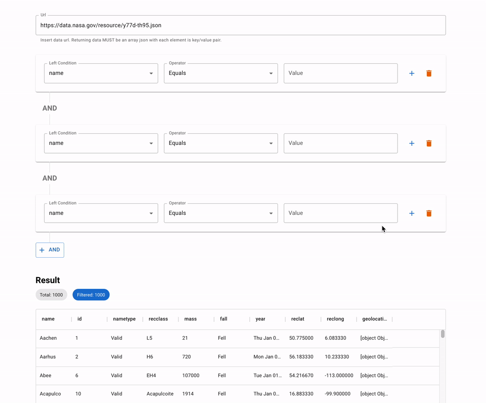
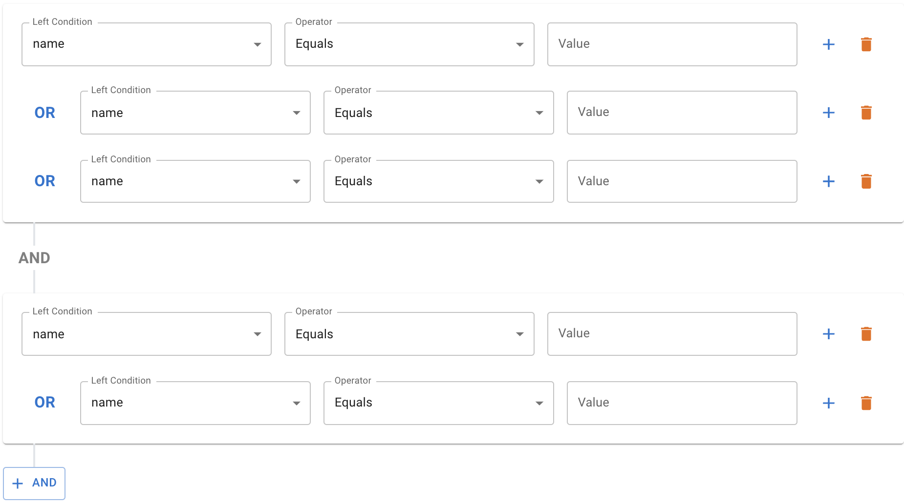
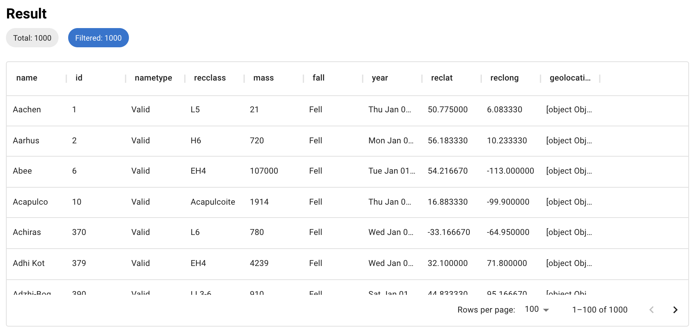
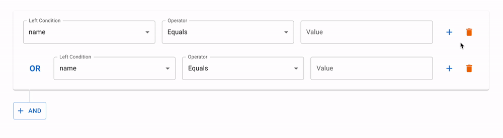

# Constellation Agency > Software Engineering > Take-Home Project

## Introduction

This take-home project is called the **Condition Builder**. This tool allows you to load an array of data and layer in _and_/_or_ conditions to filter the data. The goal of this take-home project is to test the following:

- Ability to create a UI of an web application based on provided specifications.
- Understanding of requirements and attention to detail.
- Ability to work with complex react conditional logic.
- Ability to handle error states within an application.

[Condition Builder](https://ca-recruiting-exercises.vercel.app/)

## Features

1. User should be able to load array of data from an url.
2. User should be able to build **or** conditions concatenated with **and** conditions.
   - For an example, any `c{n}` resolved to be a boolean (ex. name equals to "something"), then the condition can be formed as `(c1 || c2 || c3) && (c4 || c5)`.
3. User should be able to add `or` condition by pressing the plus button at the end of each row.
4. User should be able to add `and` condition by pressing the and button below each card container.
5. User should be able to see list of loaded data on the bottom of the page.
6. User should be able to see filtered data list when valid conditions are built.

## Supported condition operators

Each condition should have few comparisons.

- Equals
- Greater than
- Less than
- Contain
- Not Contain
- Regex

In the end, these conditions should filter out the source data.

## What you should do?

### Requirements

- Condition builder UI
  - Top section where all the logic rules can be set
    
- Result section UI
  - Visual can be your choice, it does not have to be in a table.
    
- Input validations
  - For comparison operators (Greater Than, Less Than), the entered value must be number. Visually indicate this invalid input value.

### Nice to have

The following is optional. These are nice to have options that will give you bonus points.

- Visual feedback on where new `or` condition will be inserted when user hover over plus button (optional)
  
- Input validations
  - For comparison operators (Greater Than, Less Than), the entered value must be number. Visually indicate this invalid input value.
- Cypress tests (optional)
- Unit test (optional)

## How to submit?

In order to submit your take-home project, please create new **private repository** and add the following members.

- [Nauman Hafiz](https://www.github.com/canisvulgaris)
- [Jonathan Parsons](https://www.github.com/jmparsons)
- [Edward Chung](https://www.github.com/munjo5746)
- [Yoelvis Mulen](https://www.github.com/ymulenll)
- [Matias Alibertti](https://github.com/mattrc)
