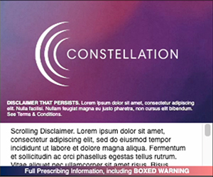

# Constellation Software > Web Engineering > Display Banner

## Objective
Create a 300x250 web display banner that adheres to the design guidelines and structure depicted in the provided sample image and the below video. Your banner should be implemented using only vanilla HTML, JavaScript, and CSS.

## Deliverables

- **HTML File:** Structure your banner within an HTML file named `index.html`.
- **CSS File:** Style your banner using a CSS file named `styles.css`.
- **JavaScript File:** Include any necessary interactive elements or animations with a JavaScript file named `script.js`.
- **Assets:** Include any assets that need to be referenced.

## Design Specifications

[Link to higher quality MP4](https://github.com/Constellation-Engineering/const-recruiting-exercises/assets/1391832/914f41f3-9f87-42ba-a2cf-59d581af5029)

- **Dimensions:** The banner should be exactly 300x250 pixels.
- **Layout:**
  - Please follow the video mock below as precisely as possible with placement and animations. This does not need to be pixel perfect, but we just want to see a solid grasp of HTML/CSS/Javascript.
  - Include a persistent disclaimer at the bottom of the banner with a smaller font size that is legible.
  - All text can be Lorem Ipsum
- **Assets:** Use attached logo and background image - you can also try using css for the background that somewhat matches the visual mock.
<!--  -->

<!--  -->
  

- **Fonts:** Choose a web-safe font or include a Google Fonts link for a font that closely matches the sample. Ensure the font sizes are readable and scale appropriately to the size of the banner.
- **Content:**
  - Please follow the included video 
  - The main area of the banner should include placeholder text. Use Lorem Ipsum for any text content.
  - The bottom section should have a scrolling disclaimer text. Implement the scrolling effect using vanilla JavaScript.

## Functional Requirements

- **Interactivity:**
  - The banner must include a scrolling disclaimer text at the bottom. This should automatically scroll indefinitely.
  - Ensure that the scrolling is smooth and continuous.

## Testing and Compatibility

- Test your banner in at least two different web browsers (e.g., Chrome and Firefox) to ensure consistency in appearance and functionality.
- Document any browser-specific considerations or issues you encounter and how you addressed them.

## Submission Instructions

- Bundle your `index.html`, `styles.css`, `script.js`, and asset files into a zip file named `[YourName]-WebDisplayBanner.zip`.
- Write a brief README document explaining your design choices, any challenges you faced, and how to view the banner in a browser.
- Share a Github Repository with your code and the ZIP file with the following users: 
[Nauman Hafiz](https://www.github.com/canisvulgaris)
[Joanne Liu](https://github.com/jliucreative)
- OR Email the zip file and the README document to people@helloconstellation.com.

## Evaluation Criteria

- **Adherence to Design:** The banner matches the layout and aesthetic of the provided sample image.
- **Code Quality:** HTML, CSS, and JavaScript code should be clean, well-organized, and commented where necessary.
- **Functionality:** All elements display as described, with smooth and continuous animations.
- **Cross-Browser Compatibility:** The banner should look consistent and function properly across the tested web browsers.

Good luck with your exercise, and we look forward to seeing your creative implementation!

